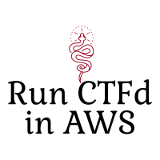
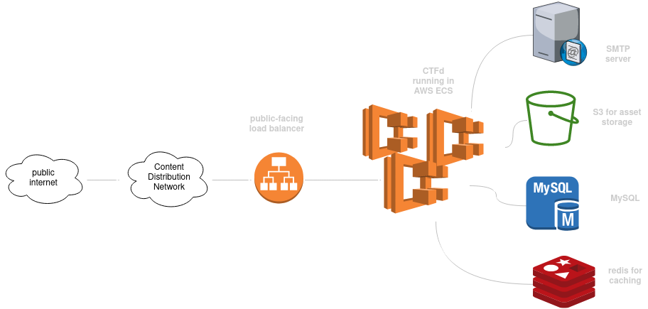

# CTFd on AWS




Build yourself some serverless infra to run [`ctfd`](https://github.com/CTFd/CTFd/) in AWS.

## Requirements

- [`terraform`](https://www.terraform.io/) (this was built and tested with v1.2.2)
- Existing VPC and subnet IDs for AWS resources
- SMTP server and credentials, such as [AWS SES](https://docs.aws.amazon.com/ses/latest/DeveloperGuide/send-email-smtp.html) or [Mailgun](https://www.mailgun.com/)
- Wildcard certificate managed by [AWS Certificate Manager](https://aws.amazon.com/certificate-manager/)

## Things To Know

- Secrets are expected to be stored in [SSM Parameter Store](https://docs.aws.amazon.com/systems-manager/latest/userguide/systems-manager-parameter-store.html) under the path `/ctfd/`.

## Architecture

Design choices have been documented and can be found in [`docs/adr`](docs/adr).



## Usage
Populate your `myvars.tfvars` file appropriately, then you're ready to go!

```
~ cat myvars.tfvars
vpc_id        = "vpc-abc123"
alb_subnets   = ["subnet-abc124", "subnet-abc123", "subnet-abc125"]
region        = "us-east-1"
mailfrom_addr = "hello@example.com"
mail_server   = "localhost"
mail_port     = "25"
ecs_subnets   = ["subnet-abc124", "subnet-abc123", "subnet-abc125"] 
desired_count = 1
db_subnets    = ["subnet-abc124", "subnet-abc123", "subnet-abc125"]
mail_password_arn = "arn:aws:ssm:us-east-1:123456789123:parameter/ctfd/mail_password"
mail_username_arn = "arn:aws:ssm:us-east-1:123456789123:parameter/ctfd/mail_username"

~ terraform apply -var-files=myvars.tfvars
```

## Where are the Virtual Machines?
If you're looking for the older version that ran on VMs, you can find it [here](https://github.com/maxdotdotg/ctfd-infra/tree/ctfd-v2.5.0).
